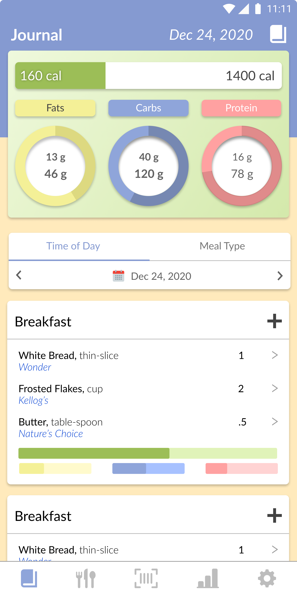
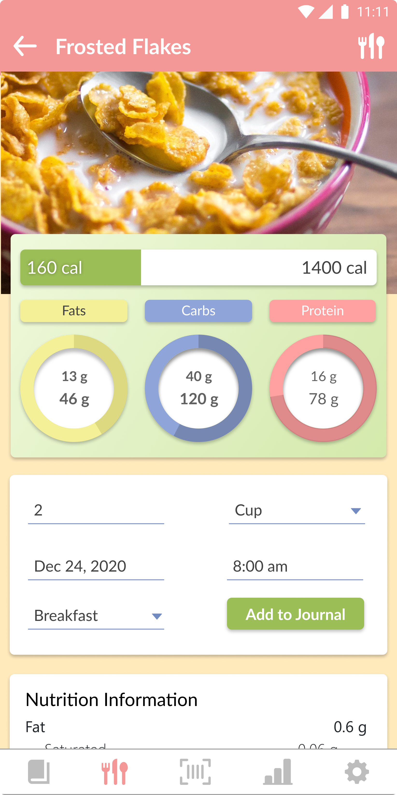

<!-- PROJECT LOGO -->
<br />
<p align="center">
  <h1 align="center">NutriJournal</h1>
  <p align="center">
    
    
    
  </p>
  <p align="center">
    <a href="https://expo.io/@dave_vazquez/projects/rn-nutrition">View Demo</a>
    <span>&nbsp;|&nbsp;</span>
    <a href="https://github.com/dave-vazquez/rn-nutrition-tracker/issues">Report Bug</a>
    <span>&nbsp;|&nbsp;</span>
    <a href="https://github.com/dave-vazquez/rn-nutrition-tracker/issues">Request Feature</a>
    <br />
  </p>
</p>


<!-- TABLE OF CONTENTS -->
<summary><h2 style="display: inline-block">Table of Contents</h2></summary>
<ol>
 <li>
    <a href="#getting-started">Getting Started</a>
    <ul>
      <li><a href="#prerequisites">Prerequisites</a></li>
      <li><a href="#installation">Installation</a></li>
    </ul>
  </li>
  <li><a href="#built-with">Built With</a></li>

  <li><a href="#roadmap">Roadmap</a></li>
  <li><a href="#contributing">Contributing</a></li>
  <li><a href="#license">License</a></li>
  <li><a href="#contact">Contact</a></li>
</ol>

<!-- GETTING STARTED -->
## Getting Started
### Prerequisites

This application was built using Expo, a framework and platform for the development of universal React applications, containing a set of tools and services built around React Native and native platforms.

**To run this application locally on physical device or simulator:**

* Install the Expo-CLI
  ```sh
  npm install --global expo-cli
  
  or

  yarn add global expo-cli
  ```

**To run this application on a physical device:**
* [Install Expo Client for Android](https://play.google.com/store/apps/details?id=host.exp.exponent&hl=en_US&gl=US)
* [Install Expo Client for iOS](https://apps.apple.com/us/app/expo-client/id982107779)

**To run this application on Android emulator**

* [Install latest version of Android Studio](https://developer.android.com/studio)

**To run this application on iOS emulator**

* [Install latest version of Xcode](https://developer.apple.com/xcode/)

### Installation

1. Clone the repo:
   ```sh
   git clone https://github.com/dave-vazquez/rn-nutrition-tracker.git
   ```
2. Install packages:
   ```sh
   yarn install
   ```
3. Launch the development server (Expo's Metro Bundler) in your browser:
   ```sh
   yarn start

   or

   expo start
   ```
4. To run on physical device: 
   * Choose LAN to connect your device via Wifi (reccomended for faster reloads)
   * Choose Tunnel to connect your device via USB
5. To run on iOS simulator:
   * Open XCode
   * Select "Run on iOS simulator" from the Metro Bundler server
6. To run on Android simulator:
   * Open Android Studio
   * Create a new Simulation Device
   * Select "Run on iOS simulator" from the Metro Bundler server

<!-- BUILTWITH -->
### Built With

#### Client
* [React Native](https://reactnative.dev/)
* [React Navigation v4](https://reactnavigation.org/)
* [Context API](https://reactjs.org/docs/context.html)
* [Expo](https://docs.expo.io/)

#### Server
* [Node.js](https://nodejs.org/en/)
* [Express.js](https://expressjs.com/)
* [Knex.js](http://knexjs.org/)
* [Knex.js](http://knexjs.org/)
* [PostgreSQL](https://www.postgresql.org/)

<!-- ROADMAP -->
## Roadmap

See the list of [open issues](https://github.com/github_username/repo_name/issues) or [project board](https://github.com/dave-vazquez/rn-nutrition-tracker/projects/1) for a list of proposed features (and known issues).


<!-- CONTRIBUTING -->
## Contributing

All contributions to this repo are encouraged and greatly appreciated:

1. Clone the respository
2. Create a new feature branch `git checkout -b feature/new-feature`
3. Commit your changes `git commit -m 'commit description'`
4. Push to branch `git push origin feature/new-feature`
5. Open a new Pull Request

<!-- LICENSE -->
## License

Distributed under the [MIT License]("./LICENSE.md"). 

<!-- CONTACT -->
## Contact

David Vazquez - [davidmvazquez1@gmail.com](mailto:davidmvazquez1@gmail.com)